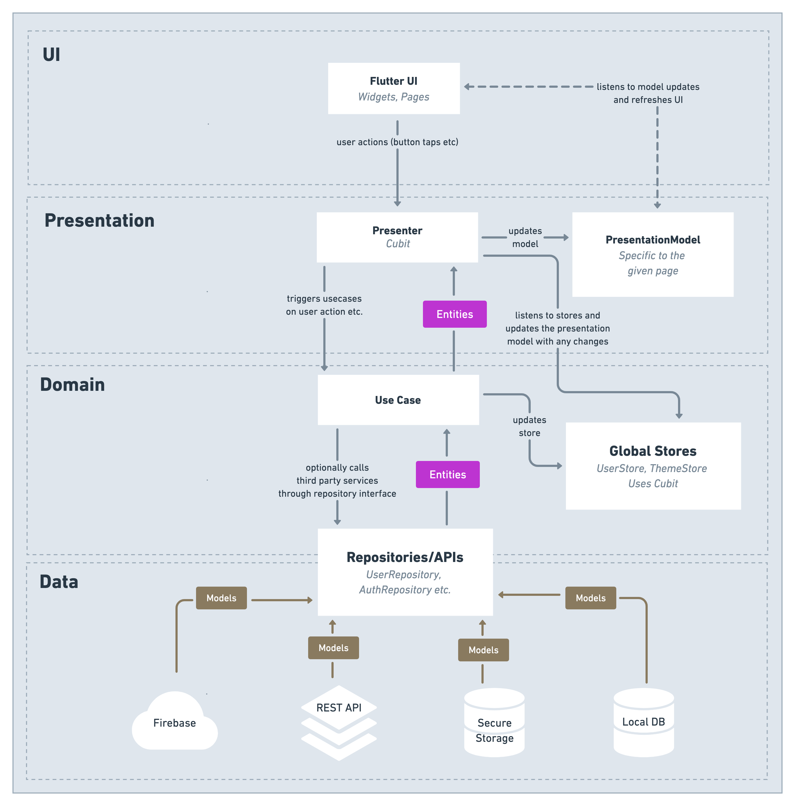

## 项目介绍

本项目遵循 Robert C. Martin 的 Clean Architecture 分层思想，将业务规则与框架代码彻底解耦，并借助 GetX 实现轻量、高性能的状态、路由及依赖管理；Get CLI 
则负责脚手架与代码生成，显著降低样板代码与工程配置成本。Clean 
Architecture 的权责和边界在下文有详细说明。





| **层级**  | **职责**                              | **与其他层的关系**                |
|---------|-------------------------------------|----------------------------|
| **展示层** | - UI 展示与交互<br>- 状态管理与用户输入转发         | - 调用领域层的用例执行操作，展示结果        |
| **领域层** | - 负责核心业务逻辑<br>- 定义领域模型与用例<br>- 提供接口 | - 不依赖其他层，使用接口与数据层交互，展示层调用用例 | 
| **数据层** | - 数据获取、持久化<br>- 数据转换与存储接口的实现        | - 实现领域层定义的接口，依赖领域层的接口      |
| **基础层** | - 基础功能<br>- 基础组件,三方工具,全局方法          | - 架构的底层支持,为其他层提供基础服务和工具    |


### 数据流：<br>
UI ↔ Controller ↔ UseCase ↔ Repository ↔ DataSource(DB、Api、SharedPreference)) ↔ 外部世界。<br>


### 目录结构

```plaintext
lib
├── presentation                        # 展示层
│   
├── domin                               # 领域层
│   ├── entities                        # 实体   
│   ├── repositories_protocols          # 仓储库协议
│   └── use_cases                       # 用例
│   
├── data                                # 数据层
│   ├── datasources                     # 数据源
│   │   ├── server                      # 服务器
│   │   ├── database                    # 数据库
│   │   └── persistence                 # 持久化
│   └── repositories                    # 仓储库
│      
├── infrastructure                      # 基础设施层
│   ├── base                            # 基类
│   ├── constants                       # 常量  
│   ├── extension                       # 扩展  
│   ├── framework                       # 三方框架
│   ├── macro                           # 宏
│   ├── navigation                      # 路由
│   ├── popup                           # 弹窗
│   ├── theme                           # 主题
│   └── utils                           # 工具类
│   
├── generated                           # 资源常量
├── config.dart                         # 配置文件
└── main.dart                           # 入口文件
```

